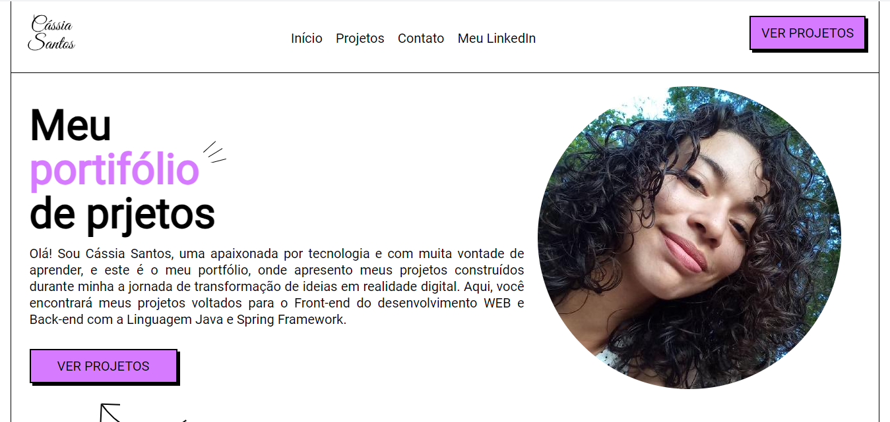
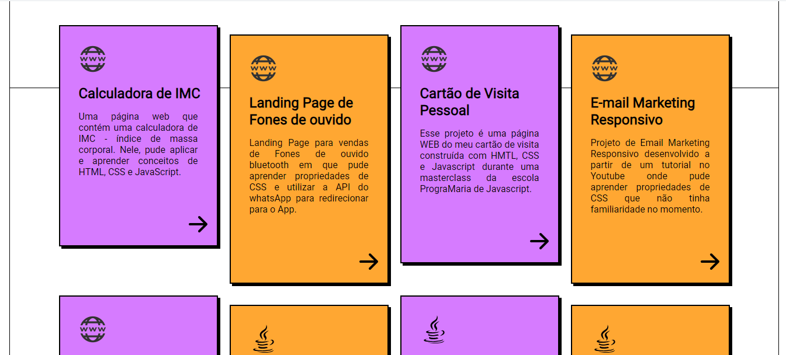
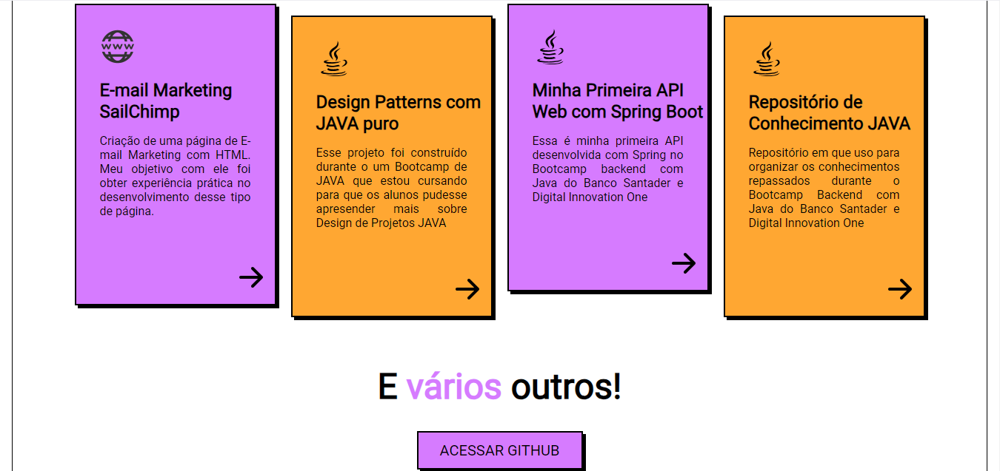
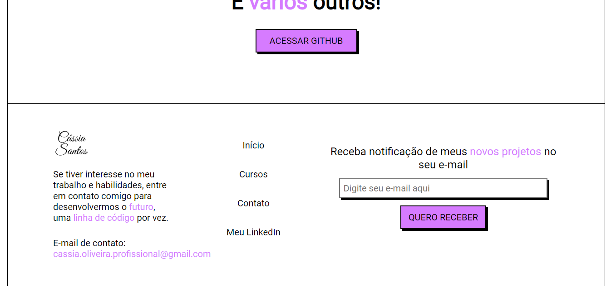

# Portifolio de projetos com Programação WEB

Esse repositório serve para armazenar um meu portifólio construído com HTML e CSS como atvidade da disciplina de programação para Web, ministrada no 5º semestre do curso de Sistemas de Informação da Universidade Federal do Oeste do Pará.

### Você pode visualizar o resultado final em: <a>https://cassiasantos.github.io/cassia-santos-portifolio-de-projetos/</a>

### Visualização da versão desktop do projeto:

